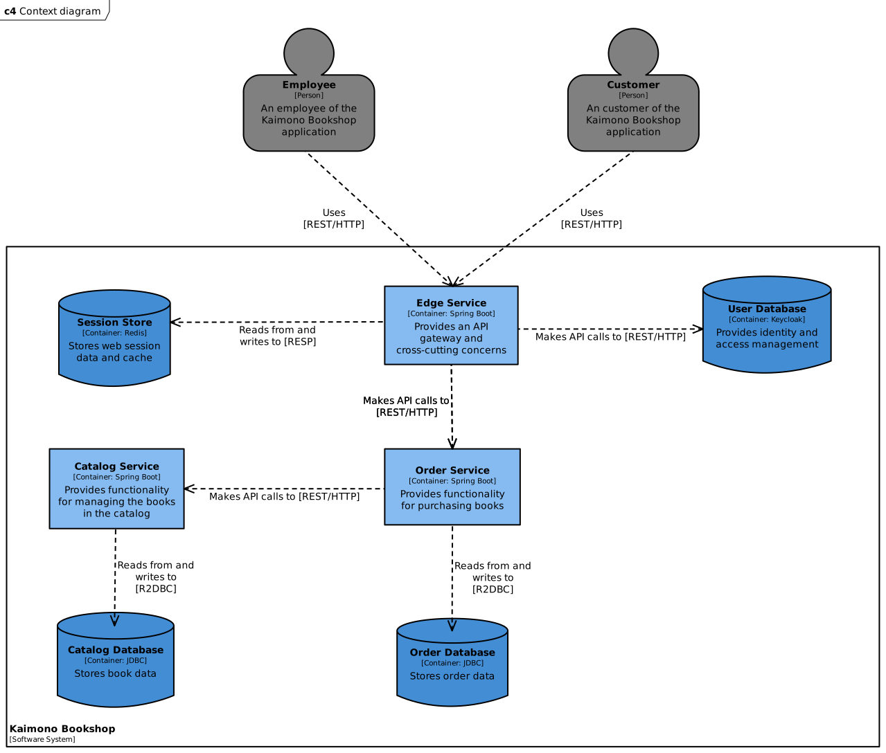

**Kaimono** is a cloud native bookstore.

> **Warning**
> This project is in progress and under continuous refinement. Future improvements include:
>
> - [ ] Adding Grafana's observability stack
> - [ ] Migrating 'Catalog Database' to Elasticsearch
> - [ ] Using Kafka as intra-service message exchanger
> - [ ] Developing an Angular UI
> - [ ] Providing instructions for deployment on DigitalOcean

All services feature a top-down reactive communication model based on [Project Reactor](https://projectreactor.io/),
externalized configurations through [Docker](https://www.docker.com/) or [Kubernetes](https://kubernetes.io/),
Role-Based Access Control (RBAC) based on [OAuth 2.1](https://oauth.net/2.1/) and [OpenID Connect](https://openid.net/connect/) standards,
schema versioning, continuous delivery pipelines and much more.  For further information, refer to the following repositories:

| Name                                                                   | Description                                                  |
|------------------------------------------------------------------------|--------------------------------------------------------------|
| [Edge Service](https://github.com/leowajda/kaimono-edge-service)       | Provides an API gateway and cross-cutting concerns           |
| [Order Service](https://github.com/leowajda/kaimono-order-service)     | Provides functionality for purchasing books                  |
| [Catalog Service](https://github.com/leowajda/kaimono-catalog-service) | Provides functionality for managing the books in the catalog |

